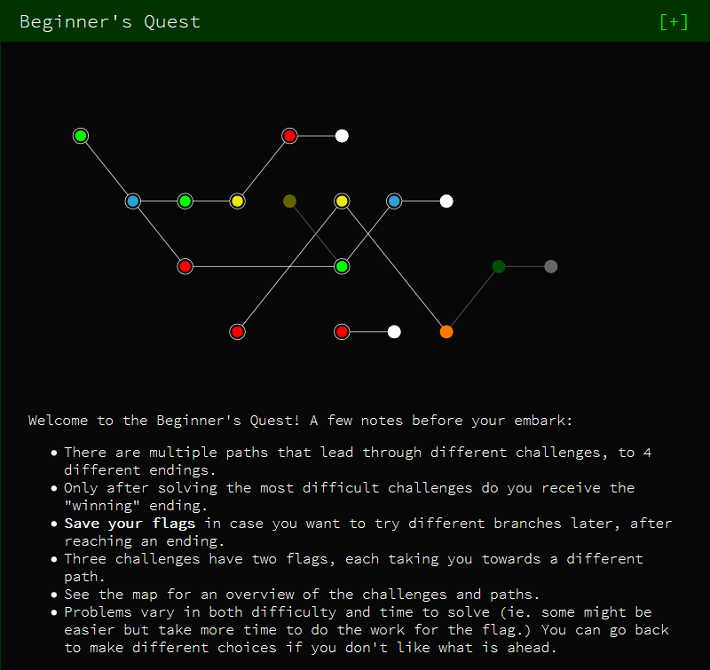

# Google CTF 2019 Beginner's quest

Never done a ctf or have any background in security before so I've decided to try the [beginner's quest](https://capturetheflag.withgoogle.com/#beginners/) and put my solutions in the repo

## Tasks
- [Enter Space-Time Coordinates / reversing-rand2](/01-reversing-rand2/README.md)
- [Satellite / misc-satellite](/02-misc-satellite/README.md)
- [Work Computer (ORME) / reversing-family-computer](/03-reversing-family-computer/README.md)
- [Government Agriculture Network / web-gov-xss](/04-web-gov-xss/README.md)
- [STOP GAN / pwn-buffer-overflow](/05-pwn-buffer-overflow/README.md)
- [Work Computer / sandbox-readme](/06-sandbox-readme/README.md)
- [FriendSpaceBookPlusAllAccessRedPremium.com / reversing-emoji](/07-reversing-emoji/README.md)
- [Drive to the target / misc-drive-to-target](/08-misc-drive-to-target/README.md)
- [Cookie World Order / web-cwo-xss](/09-web-cwo-xss/README.md)
- [Crypto Caulingo](/10-crypto-caulingo/README.md)
- [Gate Lock / hardware-gatelock](/11-hardware-gatelock/README.md)

